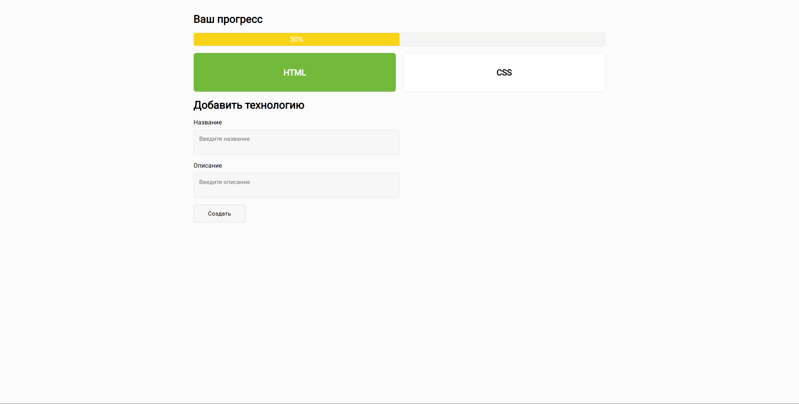

# Tech Tracker 🚀

**Tech Tracker** — это простое веб-приложение, помогающее отслеживать прогресс в изучении технологий. Вы можете добавлять технологии, указывать их описание, отмечать как "изученные" и видеть общий прогресс в процентах.

## 📸 Скриншот


---

## 🔧 Функционал

- **Добавление новых технологий:**  
  Заполните форму с названием и описанием, чтобы добавить новую технологию.

- **Отметка "Выучил":**  
  В модальном окне вы можете отметить технологию как изученную.

- **Прогресс в процентах:**  
  Полоса прогресса показывает, какой процент технологий вы уже освоили.

- **Удаление технологий:**  
  Удалите любую запись прямо из модального окна.

- **Хранение данных:**  
  Все данные сохраняются в `localStorage`, поэтому они не пропадают при перезагрузке страницы.

---

## 💻 Как запустить локально

1. **Клонируйте репозиторий:**
   ```bash
   git clone https://github.com/ваше-имя/tech-tracker.git
   ```

2. **Перейдите в папку проекта:**
   ```bash
   cd tech-tracker
   ```

3. **Откройте `index.html` в браузере:**
   Просто откройте файл в любом современном браузере (Chrome, Firefox и т.п.).

   > Для работы не требуется сервер — всё работает на клиентской стороне.

---

## 📁 Структура проекта

```
tech-tracker/
├── index.html       - Основная HTML-разметка
├── style.css        - Стили проекта
├── app.js           - Логика приложения
└── README.md        - Документация
```

---

## 🛠️ Технологии

- HTML5
- CSS3 / Flexbox
- JavaScript (ES6+)
- localStorage API
- Google Fonts (Roboto)

---

## ✅ Возможности для доработки (TODO)

- [ ] Добавить возможность редактирования записи
- [ ] Реализовать фильтры по статусу (все / изученные / не изученные)
- [ ] Поддержка темной темы
- [ ] Анимации при добавлении/удалении карточек
- [ ] Экспорт списка технологий в JSON или CSV
